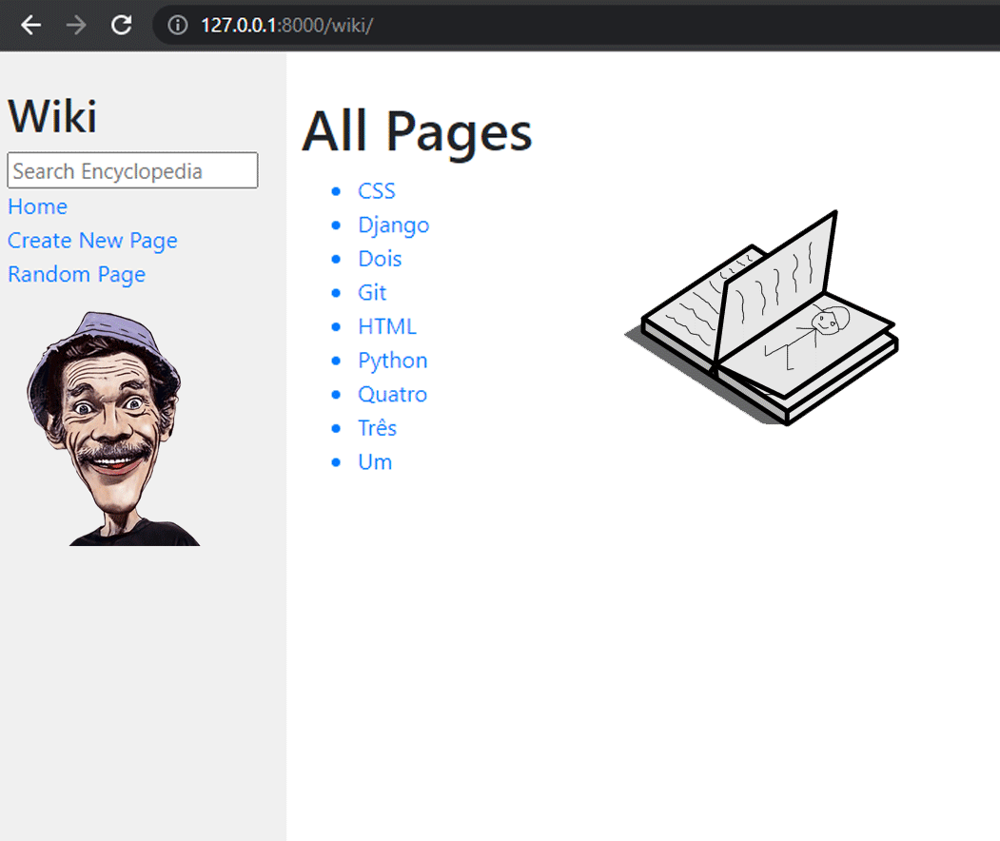
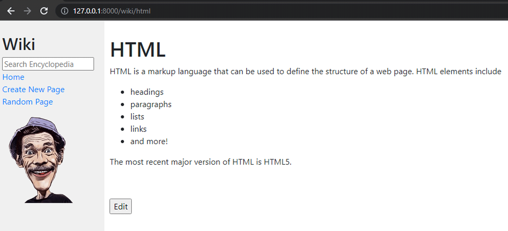
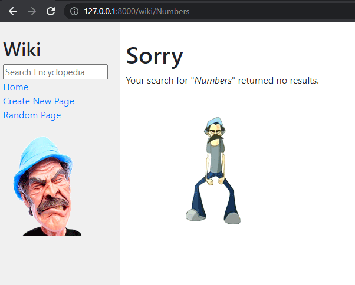
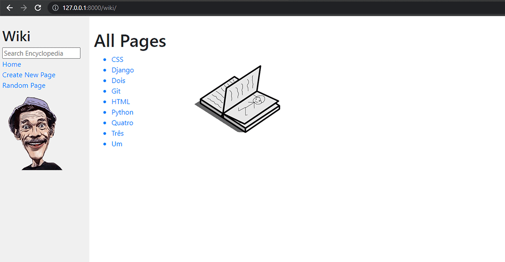
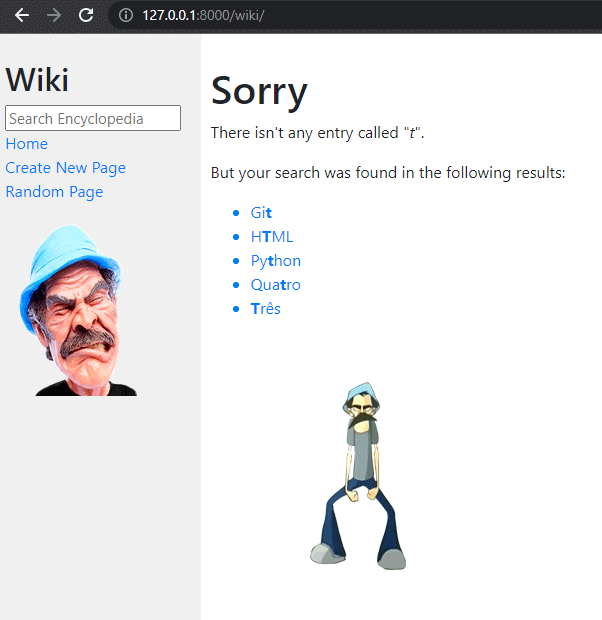
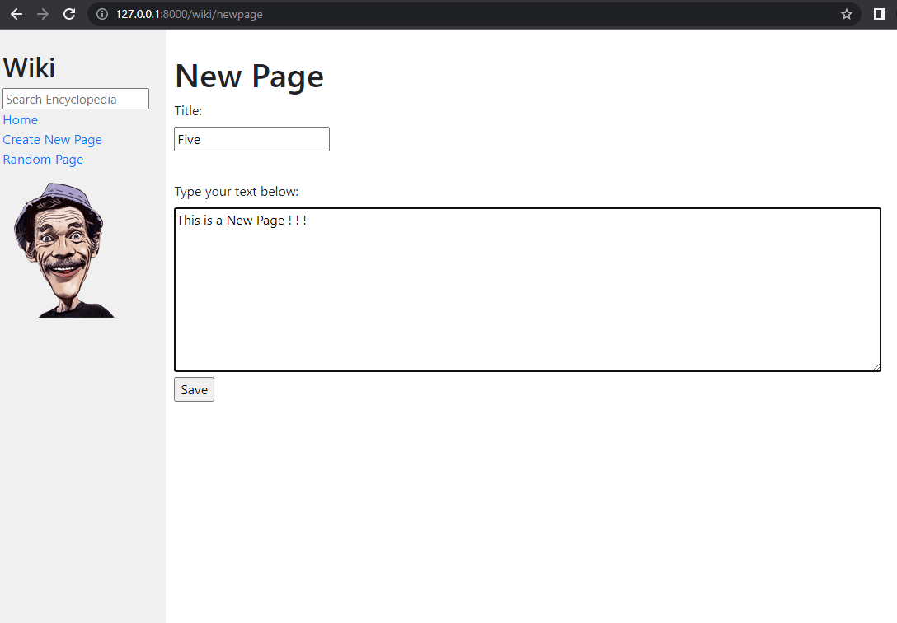
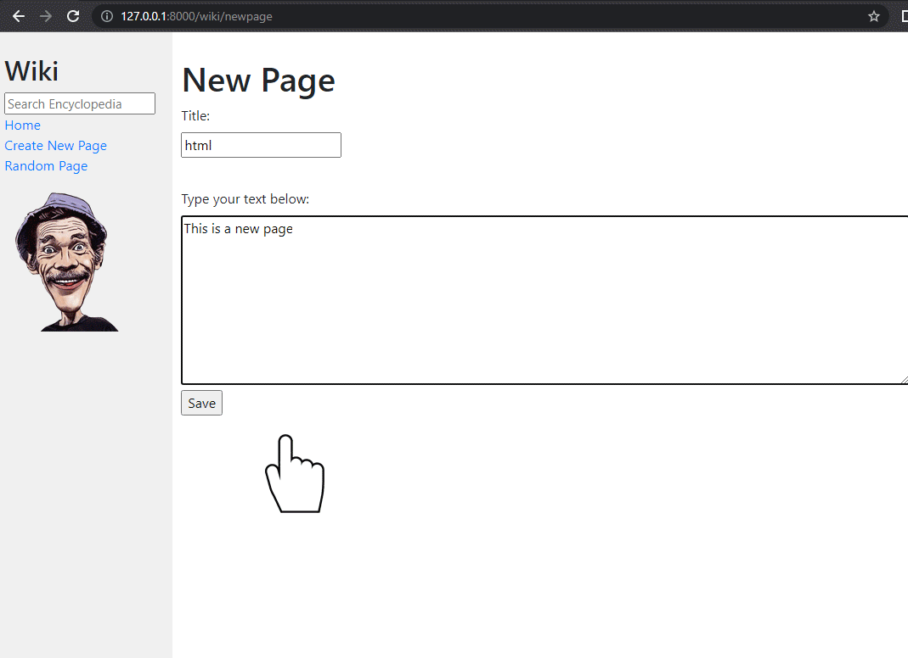
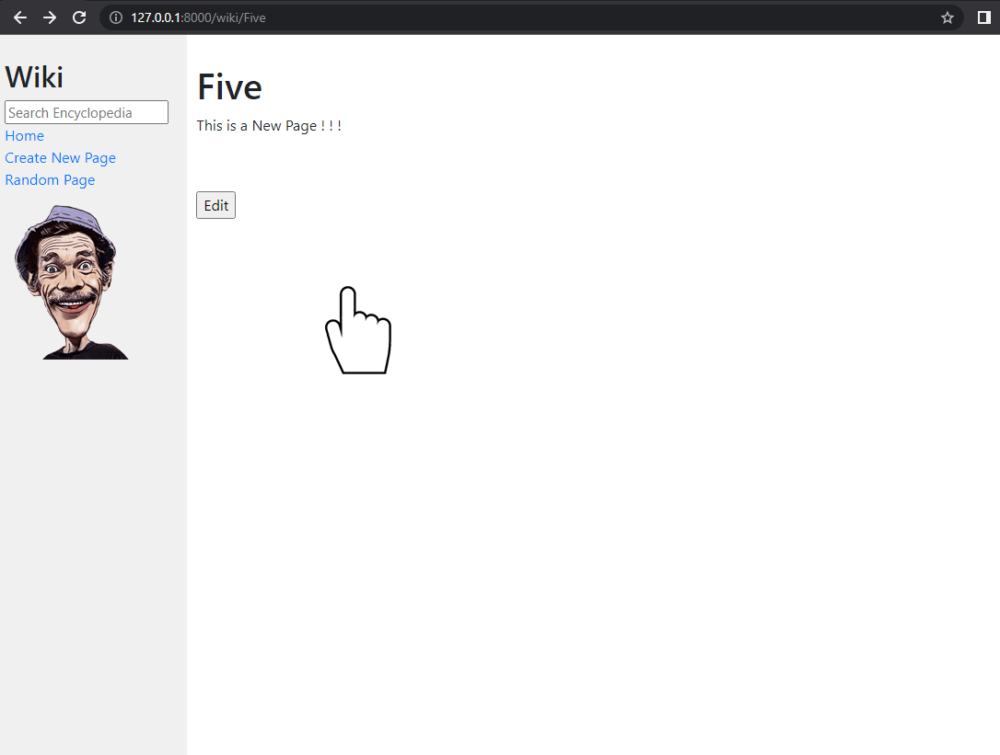
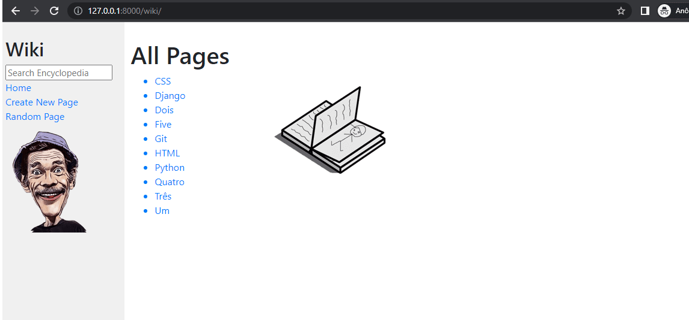
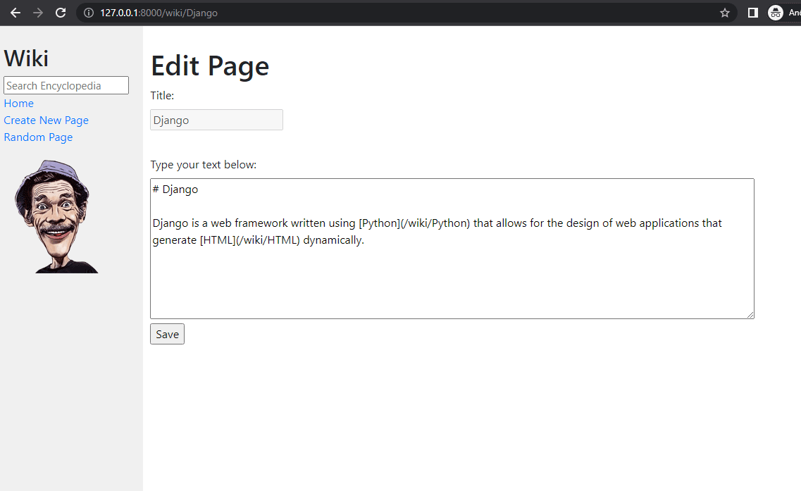

# Project 1, CS50W
#### Video Demo:  <https://www.youtube.com/watch?v=p8A9X4k0KUs>

## Index
* [Title and Logo](#Title-and-Logo)
* [Badges](#badges)
* [Index](#index)
* [Project Description](#project-description)
* [Project Status](#project-status)
* [Application, Features and Requirements](#application-features-and-requirements)
* [Details](#details)
* [Developer](#developer)
* [Conclusion](#conclusion)

## Project Description

 In the Project 1 for CS50W, we must complete the implementation of a <b>Wiki encyclopedia</b> fulfilling some requirements which we're going to see forward, like displaying entries, adding new ones and editing any of them as well. The new challenge here is that we're going to  deal with <b>Django</b> for the first time and it's exactly this new tool which we're going to use in order to succeed this journy.

## Project Status
I suppose this project is ready without many lacks to fix.

## Application, Features and Requirements

This work was made in <b>Django</b>, that is, it was employed a lot of <b>Python</b>, <b>HTML</b> and almost none CSS. If we want this project runs properly, it is necessary to install <b>Django</b> and <b>markdown2</b>, the last one is required only to keep a pattern for the saved files and do the interpretation between the languages <b>MarkDown</b> and <b>HTML</b>.

## Details

Below, all the details about this project:

### Entry Page

Visiting <b>/wiki/TITLE</b>, where <b>TITLE</b> is the title of an encyclopedia entry, we should see a page with the content of that encyclopedia entry displayed on it and the title of the page should include the name of the entry.

In case we request an entry that does not exist, a page must be shown warning this event.

### Index Page

On the index page, we should be able to click on any of the entries that are shown and to be taken directly to corresponding page.

## Search

There is a search box in the sidebar and its function is taking us to the entry corresponding with we type in it. If there isn't any existing entry for our search, an apology page is displayed. But if the word that was typed is part of one or more entries, all of them must be shown as options to the user.

## New Page

There is also, in the sidebar, a place called "<b>Create New Page</b>". This part must work in that way if we click on it, a page should be opened with an area for title and another one, a text area, for the content. There must be a button in order to save the new entry and store it inside a folder called "<b>entries</b>" in "<b>MD - MarkDown</b>" format.
 

If the title which we picked already exists, a page warning this condition should be presented to us:

## Edit Page

It's totally understandable if we want to edit an entry. For this reason a button was put to do this on each entry page. When we click on this button a page very similar with the one where we create an entry is displayed to us, with the difference that the text area is pre-populated in order to facilitate the edition and the title area is also pre-typed, but in this one it's not allowed change anything. If we save the changes, the application takes us directly to the respective entry page.

## Random Page

Like it was asked for us in this project, everytime we click "<b>Random Page</b>" in the sidebar, we should take to a random entry page:

## Markdown to HTML Conversion

 The way that the entries are saved is in "<b>Markdown Language</b>" and, because of that, they carry a bunch of elements inside their contents in order to customize styles, links, etc. These elements will display on the page if there isn't a conversion from <b>Markdown</b> to <b>HTML</b> and it's another feature that must work properly:

## Developer
I'm really honored in begin to make part of this world of programming. My name is Raphael Freitas. I'm Brazilian, I'm from Lorena (my city) São Paulo (my state) and my contact is raphaeuaf@yahoo.com.br.

## Conclusion

I want to thank <b>Harvard University / EDX</b> for this oportunity. I am really, really grateful.
